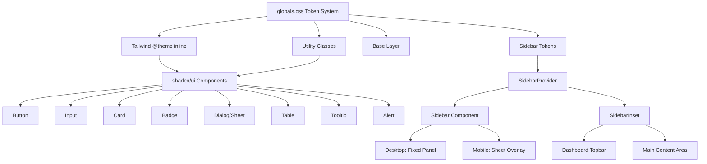

# Design Document: Design System Overhaul

## Overview

This design system overhaul replaces the existing oklch-based token system in globals.css with a comprehensive, layered design token architecture built around the primary blue `#2f9fee`. The system introduces semantic surface tokens, control tokens, overlay tokens, motion tokens, and utility classes that provide a calm, modern, polished interface with full dark mode support.

The implementation targets a Next.js 16 app using Tailwind CSS v4, shadcn/ui components, and `class-variance-authority`. All shadcn/ui primitives are updated to consume the new token system via utility classes, and a full sidebar-based dashboard shell is introduced using the shadcn sidebar provider pattern.

## Architecture



## Components and Interfaces

### Component 1: Token System (globals.css)

**Purpose**: Provides all CSS custom properties, Tailwind theme mappings, base layer styles, and utility classes that power the entire design system.

**Token Categories**:
- Core colors (light/dark): `--background`, `--foreground`, `--primary`, `--secondary`, `--muted`, `--accent`, `--destructive`, `--border`, `--input`, `--ring`
- Surface tokens: `--surface-elevated-bg`, `--surface-soft-bg`, `--surface-muted-bg`, `--surface-stroke`, `--surface-shadow-*`, `--surface-footer-bg`
- Control tokens: `--control-bg`, `--control-bg-strong`, `--control-secondary-bg`, `--control-border`, `--control-shadow`, `--control-shadow-hover`
- Overlay tokens: `--overlay-surface-bg`, `--overlay-surface-border`, `--overlay-surface-shadow`, `--modal-backdrop`
- Table tokens: `--table-header-bg`, `--table-footer-bg`, `--table-row-hover-bg`, `--table-row-selected-bg`
- Alert tokens: `--alert-surface-bg`, `--alert-destructive-surface-bg`
- Tooltip tokens: `--tooltip-surface-bg`, `--tooltip-surface-fg`, `--tooltip-surface-border`
- Motion tokens: `--motion-duration-fast`, `--motion-duration-base`, `--motion-duration-slow`, `--motion-ease-*`
- Sidebar tokens: `--sidebar`, `--sidebar-foreground`, `--sidebar-primary`, `--sidebar-accent`, `--sidebar-border`, `--sidebar-ring`

**Utility Classes**:
- `surface-card`, `surface-card-footer`
- `control-surface`, `control-surface-secondary`, `control-ghost-surface`
- `overlay-surface`, `modal-backdrop`
- `tooltip-surface`
- `table-head-surface`, `table-foot-surface`, `table-row-surface`
- `alert-surface`, `alert-destructive-surface`
- `empty-surface`, `hero-panel`, `section-panel`, `soft-panel`
- `motion-transition`, `motion-lift`
- `meta-label`, `eyebrow`
- `button-primary-fixed`, `button-destructive-fixed`

### Component 2: Button

**Purpose**: Primary interaction element with multiple variants consuming control surface tokens.

**Interface**:
```typescript
interface ButtonProps extends React.ButtonHTMLAttributes<HTMLButtonElement> {
  variant?: "default" | "outline" | "secondary" | "ghost" | "destructive" | "link"
  size?: "default" | "xs" | "sm" | "lg" | "icon" | "icon-xs" | "icon-sm" | "icon-lg"
  asChild?: boolean
}
```

**Variant Mapping**:
- `default` → `button-primary-fixed` class, lift on hover
- `outline` → `control-surface` class, hover to `--control-bg-strong`
- `secondary` → `control-surface-secondary` class
- `ghost` → `control-ghost-surface` class, hover reveals `--control-accent-bg`
- `destructive` → `button-destructive-fixed` class, lift on hover
- `link` → transparent, underline on hover

### Component 3: Input

**Purpose**: Form input with control surface styling and accessible error states.

**Interface**:
```typescript
interface InputProps extends React.InputHTMLAttributes<HTMLInputElement> {}
```

**Key Classes**: `control-surface`, `h-10`, `rounded-lg`, focus ring `ring-4 ring-ring/15`, error `aria-invalid:border-destructive aria-invalid:ring-4 aria-invalid:ring-destructive/10`

### Component 4: Card

**Purpose**: Content container with elevated surface styling.

**Interface**:
```typescript
interface CardProps extends React.HTMLAttributes<HTMLDivElement> {
  size?: "default" | "sm"
}
```

**Key Classes**: `surface-card`, `rounded-xl`. Footer uses `surface-card-footer` with `border-t border-border/75`.

### Component 5: Badge

**Purpose**: Small status/label indicators with token-based variants.

**Interface**:
```typescript
interface BadgeProps extends React.HTMLAttributes<HTMLDivElement> {
  variant?: "default" | "secondary" | "destructive" | "outline" | "ghost" | "link"
}
```

### Component 6: Dialog / Sheet

**Purpose**: Modal overlays using overlay surface tokens.

**Key Classes**: Content uses `overlay-surface`, backdrop uses `modal-backdrop`, content `rounded-2xl`.

### Component 7: Table

**Purpose**: Data display with surface-token-based header, row hover, and selection states.

**Key Classes**: `table-head-surface`, `table-row-surface` (hover + selected via tokens).

### Component 8: Tooltip

**Purpose**: Contextual information popover.

**Key Classes**: `tooltip-surface` (applies bg, fg, border, shadow from tokens).

### Component 9: Alert

**Purpose**: Informational/warning messages.

**Key Classes**: `alert-surface` for info, `alert-destructive-surface` for destructive alerts.

### Component 10: Sidebar

**Purpose**: Primary navigation shell using provider-based context pattern.

**Interface**:
```typescript
interface SidebarProviderProps {
  defaultOpen?: boolean
  open?: boolean
  onOpenChange?: (open: boolean) => void
  children: React.ReactNode
  style?: React.CSSProperties
}

interface SidebarProps extends React.HTMLAttributes<HTMLDivElement> {
  side?: "left" | "right"
  variant?: "sidebar" | "floating" | "inset"
  collapsible?: "offcanvas" | "icon" | "none"
}
```

**Dimensions**: `--sidebar-width: 17.5rem`, `--sidebar-width-icon: 4.25rem`, `--sidebar-width-mobile: 18rem`

**Features**: Cookie persistence (`sidebar_state`), Cmd/Ctrl+B keyboard shortcut, collapsible icon mode, mobile Sheet rendering.

### Component 11: Dashboard Layout Shell

**Purpose**: Integrates sidebar into the `(main)` layout group.

**Structure**: `SidebarProvider` → `Sidebar` + `SidebarInset` (containing sticky topbar + main content area).

### Component 12: Font Configuration

**Purpose**: Geist Sans + Geist Mono via `next/font/local` or the `geist` package.

**Integration**: CSS variables `--font-geist-sans` and `--font-geist-mono` applied to html element, mapped in `@theme inline`.

## Data Models

### Token System Structure

```typescript
// Light/Dark mode tokens follow the same property names
// Values switch via :root and .dark selectors in CSS
type ThemeMode = "light" | "dark"

// All tokens are CSS custom properties consumed via var()
// No runtime TypeScript types needed - purely CSS-level
```

### Sidebar State

```typescript
interface SidebarContext {
  state: "expanded" | "collapsed"
  open: boolean
  setOpen: (open: boolean) => void
  openMobile: boolean
  setOpenMobile: (open: boolean) => void
  isMobile: boolean
  toggleSidebar: () => void
}
```

## Error Handling

### Missing Token Fallbacks

**Condition**: A CSS custom property is not defined (e.g., missing `.dark` definition)
**Response**: Use CSS fallback values where critical, ensure all tokens defined in both modes
**Recovery**: Build-time visual regression would catch missing tokens

### Sidebar State Persistence

**Condition**: Cookie read fails or is corrupted
**Response**: Fall back to `defaultOpen` prop value
**Recovery**: Re-create cookie on next toggle interaction

## Testing Strategy

### Unit Testing Approach

- Verify Button renders correct classes per variant/size
- Verify Card applies `surface-card` class
- Verify Badge variants produce expected class names
- Verify Sidebar context provides correct state values

### Integration Testing Approach

- Verify sidebar toggle keyboard shortcut works
- Verify sidebar mobile Sheet rendering on small viewports
- Verify dark mode token switching applies correctly

## Correctness Properties

*A property is a characteristic or behavior that should hold true across all valid executions of a system-essentially, a formal statement about what the system should do. Properties serve as the bridge between human-readable specifications and machine-verifiable correctness guarantees.*

### Property 1: Button variant-to-class mapping consistency

For any valid Button variant from the set {default, outline, secondary, ghost, destructive, link}, rendering the Button with that variant SHALL produce a className containing the expected surface class for that variant, and no other variant's surface class.

**Validates: Requirements 2.1, 2.2, 2.3, 2.4, 2.5**

### Property 2: Button size-to-dimension mapping consistency

For any valid Button size from the set {default, xs, sm, lg, icon, icon-xs, icon-sm, icon-lg}, rendering the Button with that size SHALL produce a className containing the expected height/padding classes for that size.

**Validates: Requirements 2.6**

### Property 3: Dark mode token completeness

For any CSS custom property defined in the :root selector of globals.css that represents a color, surface, or control token, a corresponding definition SHALL exist in the .dark selector.

**Validates: Requirements 13.1**

## Dependencies

- `tailwindcss` v4 (already installed)
- `tw-animate-css` (already installed)
- `class-variance-authority` (already installed)
- `geist` font package (to install)
- `cookie` or native cookie API for sidebar persistence
- shadcn/ui sidebar component (to install via CLI)
