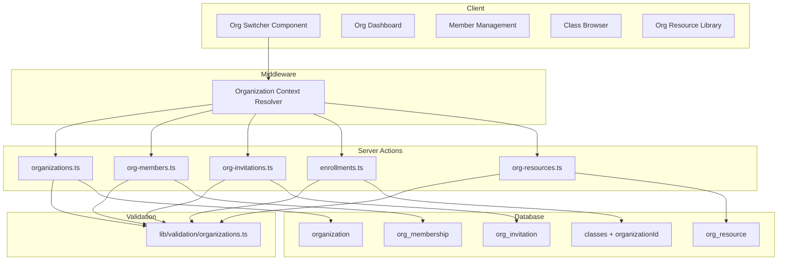
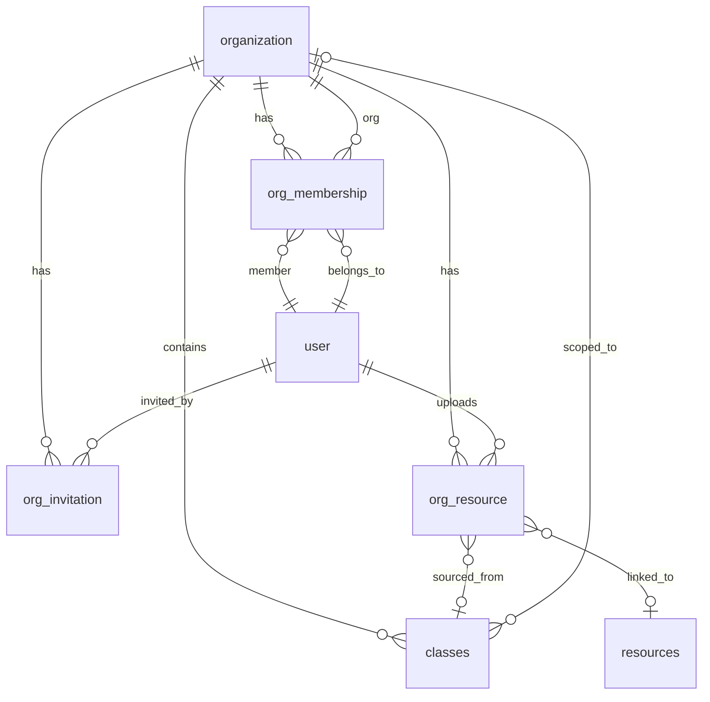

# Design Document: Organization Multi-Tenancy

## Overview

This design transforms Upclass from a flat role-based system into a multi-tenant SaaS platform. Organizations become the top-level scoping entity. Each user can belong to multiple organizations with independent role assignments. Classes, resources, and membership are scoped to an organization context. A hybrid resource model provides both organization-level shared libraries and class-scoped resources, with a publish mechanism bridging the two.

### Key Design Decisions

1. **Additive schema changes** — New tables (`organization`, `org_membership`, `org_invitation`, `org_resource`) are added alongside existing tables. The existing `classes` table gains an `organizationId` foreign key. The existing `user.role` enum remains for backward compatibility during migration but organization-scoped roles take precedence.
2. **Organization context via middleware** — A lightweight middleware resolves the user's active organization from a cookie/header and injects it into server action context, avoiding passing `orgId` through every call.
3. **Server actions per domain** — New action files (`app/actions/organizations.ts`, `app/actions/org-members.ts`, `app/actions/org-invitations.ts`, `app/actions/enrollments.ts`, `app/actions/org-resources.ts`) follow existing project conventions.
4. **Zod validation schemas** — All input validation lives in `lib/validation/organizations.ts`, consistent with the existing `lib/validation/` pattern.
5. **Slug-based routing** — Organizations are identified in URLs by their unique slug (`/org/[slug]/...`), providing human-readable and stable URLs.

## Architecture



### Request Flow

1. User authenticates via Better Auth (existing)
2. Middleware reads `x-org-slug` cookie → resolves active organization
3. Server actions receive authenticated user + active org context
4. Actions validate input with Zod schemas, enforce org-role permissions, mutate DB via Drizzle
5. UI components re-fetch/revalidate affected data

## Components and Interfaces

### New Server Actions

| File | Responsibilities |
|------|-----------------|
| `app/actions/organizations.ts` | Create org, update settings, get org details, delete org |
| `app/actions/org-members.ts` | List members, change role, remove member, get current user's org role |
| `app/actions/org-invitations.ts` | Create invitation, list pending invitations, cancel invitation, accept invitation |
| `app/actions/enrollments.ts` | List available classes, self-enroll, bulk-enroll students |
| `app/actions/org-resources.ts` | Upload to org library, list org resources, publish class resource to org library |

### New UI Components

| Component | Location | Purpose |
|-----------|----------|---------|
| `OrgSwitcher` | `components/layouts/org-switcher.tsx` | Dropdown in sidebar to switch active org |
| `OrgCreateDialog` | `components/organizations/org-create-dialog.tsx` | Modal for creating a new organization |
| `OrgSettingsForm` | `components/organizations/org-settings-form.tsx` | Form for editing org name, description, logo |
| `MemberTable` | `components/organizations/member-table.tsx` | Table of org members with role management |
| `InviteMemberDialog` | `components/organizations/invite-member-dialog.tsx` | Dialog to invite via email |
| `ClassBrowser` | `components/organizations/class-browser.tsx` | Grid of available classes for self-enrollment |
| `BulkEnrollDialog` | `components/organizations/bulk-enroll-dialog.tsx` | Multi-select student enrollment |
| `OrgResourceLibrary` | `components/organizations/org-resource-library.tsx` | Browsable org-level resource grid |
| `PublishResourceButton` | `components/organizations/publish-resource-button.tsx` | Button to promote class resource to org library |

### New Validation Schemas (`lib/validation/organizations.ts`)

```typescript
// Organization name: 2-100 chars, letters/numbers/spaces/hyphens/ampersands/apostrophes
export const orgNameSchema = z.string().min(2).max(100).regex(/^[a-zA-Z0-9\s\-&']+$/);

// Organization description: up to 500 chars
export const orgDescriptionSchema = z.string().max(500).optional();

// Org roles
export const orgRoleSchema = z.enum(["admin", "teacher", "student"]);

// Invitation creation
export const createInvitationSchema = z.object({
  email: z.string().email(),
  role: orgRoleSchema,
});

// Bulk enrollment: 1-200 student IDs
export const bulkEnrollSchema = z.object({
  classId: z.string().min(1),
  studentIds: z.array(z.string().min(1)).min(1).max(200),
});

// Class creation within org
export const createOrgClassSchema = z.object({
  title: z.string().min(2).max(100),
  description: z.string().optional(),
  category: z.string().optional(),
});
```

### Zustand Store Extension

A new `stores/org-store.ts` manages client-side organization state:

```typescript
interface OrgState {
  activeOrgId: string | null;
  activeOrgSlug: string | null;
  orgs: Array<{ id: string; name: string; slug: string; role: OrgRole }>;
  setActiveOrg: (slug: string) => void;
  setOrgs: (orgs: OrgState["orgs"]) => void;
}
```

## Data Models

### New Tables

#### `organization`

| Column | Type | Constraints |
|--------|------|-------------|
| `id` | text | PK |
| `name` | text | NOT NULL, 2-100 chars |
| `slug` | text | NOT NULL, UNIQUE, max 120 chars |
| `description` | text | nullable, max 500 chars |
| `logo` | text | nullable (URL from UploadThing) |
| `createdBy` | text | FK → user.id, NOT NULL |
| `createdAt` | timestamp | DEFAULT now() |
| `updatedAt` | timestamp | DEFAULT now(), auto-update |

Indexes: unique on `slug`

#### `org_membership`

| Column | Type | Constraints |
|--------|------|-------------|
| `id` | text | PK |
| `organizationId` | text | FK → organization.id, CASCADE, NOT NULL |
| `userId` | text | FK → user.id, CASCADE, NOT NULL |
| `role` | org_role enum | NOT NULL (admin, teacher, student) |
| `createdAt` | timestamp | DEFAULT now() |
| `updatedAt` | timestamp | DEFAULT now(), auto-update |

Indexes: unique on `(organizationId, userId)`, index on `userId`, index on `organizationId`

#### `org_invitation`

| Column | Type | Constraints |
|--------|------|-------------|
| `id` | text | PK |
| `organizationId` | text | FK → organization.id, CASCADE, NOT NULL |
| `email` | text | NOT NULL |
| `role` | org_role enum | NOT NULL |
| `token` | text | NOT NULL, UNIQUE |
| `invitedBy` | text | FK → user.id, CASCADE, NOT NULL |
| `status` | invitation_status enum | NOT NULL, DEFAULT 'pending' |
| `expiresAt` | timestamp | NOT NULL (createdAt + 7 days) |
| `acceptedAt` | timestamp | nullable |
| `createdAt` | timestamp | DEFAULT now() |

Indexes: unique on `token`, index on `(organizationId, email)`, index on `organizationId`

`invitation_status` enum: `pending`, `accepted`, `expired`, `cancelled`

#### `org_resource`

| Column | Type | Constraints |
|--------|------|-------------|
| `id` | text | PK |
| `organizationId` | text | FK → organization.id, CASCADE, NOT NULL |
| `title` | text | NOT NULL |
| `description` | text | nullable |
| `category` | text | DEFAULT 'General' |
| `fileUrl` | text | NOT NULL |
| `fileName` | text | NOT NULL |
| `fileType` | resource_file_type enum | NOT NULL (reuses existing enum) |
| `fileSize` | text | nullable |
| `uploadedBy` | text | FK → user.id, CASCADE, NOT NULL |
| `sourceClassId` | text | FK → classes.id, nullable (set when published from a class) |
| `sourceResourceId` | text | FK → resources.id, nullable (links to original class resource) |
| `createdAt` | timestamp | DEFAULT now() |
| `updatedAt` | timestamp | DEFAULT now(), auto-update |

Indexes: index on `organizationId`, index on `uploadedBy`, unique on `(organizationId, sourceResourceId)` where sourceResourceId is not null (prevents double-publishing)

### Modified Tables

#### `classes` — add column

| Column | Type | Constraints |
|--------|------|-------------|
| `organizationId` | text | FK → organization.id, nullable initially (for migration), then required for new classes |

New index on `organizationId`.

### New Enums

```sql
CREATE TYPE org_role AS ENUM ('admin', 'teacher', 'student');
CREATE TYPE invitation_status AS ENUM ('pending', 'accepted', 'expired', 'cancelled');
```

### Entity Relationship Diagram




## Correctness Properties

*A property is a characteristic or behavior that should hold true across all valid executions of a system—essentially, a formal statement about what the system should do. Properties serve as the bridge between human-readable specifications and machine-verifiable correctness guarantees.*

### Property 1: Organization Name Validation

*For any* string, the organization name validation function SHALL accept it if and only if it is between 2 and 100 characters long and contains only letters, numbers, spaces, hyphens, ampersands, and apostrophes.

**Validates: Requirements 1.2, 1.5**

### Property 2: Slug Derivation Correctness

*For any* valid organization name, the generated slug SHALL equal the name lowercased, with spaces replaced by hyphens and all characters not matching `[a-z0-9\-]` removed, truncated to a maximum of 120 characters.

**Validates: Requirements 1.3**

### Property 3: Slug Uniqueness with Sequential Suffix

*For any* set of organizations with names that produce identical base slugs, each generated slug SHALL be unique, with duplicates resolved by appending `-1`, `-2`, etc. in sequential order.

**Validates: Requirements 1.4**

### Property 4: Organization Creator Becomes Admin

*For any* valid organization creation request, the creating user SHALL be assigned as an Org_Member with the `admin` role in the newly created organization.

**Validates: Requirements 1.1**

### Property 5: Role-Based Authorization Enforcement

*For any* protected operation (invitation creation, role management, member removal, class creation, bulk enrollment, org library upload, resource publishing, settings modification), the operation SHALL succeed only if the requesting user holds the minimum required org role (admin for admin-only ops, teacher/admin for teacher-level ops) within the target organization.

**Validates: Requirements 2.2, 3.5, 4.2, 6.6, 7.3, 8.2, 10.3**

### Property 6: Invitation Acceptance Round-Trip

*For any* valid invitation that is accepted by a user, the Membership_Service SHALL create an org_membership record with the role specified in the invitation AND the invitation token SHALL be marked as used (status != 'pending') such that subsequent acceptance attempts fail.

**Validates: Requirements 2.3**

### Property 7: Invitation Uniqueness Constraints

*For any* organization and email address, the Invitation_Service SHALL reject a new invitation if there already exists either (a) an active org_membership for that email in that organization, or (b) a pending org_invitation for that email in that organization.

**Validates: Requirements 2.4, 2.8**

### Property 8: Last Admin Protection

*For any* organization with exactly one member holding the `admin` role, any attempt to change that member's role to a non-admin value SHALL be rejected.

**Validates: Requirements 3.3**

### Property 9: Member Removal Cascades Class Memberships

*For any* org member who is removed from an organization, all their class_membership records for classes within that organization SHALL be deleted.

**Validates: Requirements 3.4**

### Property 10: Same-Role Change Rejection

*For any* org member and role change request where the target role equals the member's current role, the Membership_Service SHALL reject the operation.

**Validates: Requirements 3.6**

### Property 11: Organization Data Isolation

*For any* two distinct organizations A and B, querying classes, resources, or members from organization A's context SHALL never return entities belonging to organization B.

**Validates: Requirements 4.3, 5.3, 9.4**

### Property 12: Class Assignment Requires Org Membership

*For any* teacher assignment to a class within an organization, the assignment SHALL succeed only if the teacher is an existing org_member of the same organization as the class.

**Validates: Requirements 4.4, 4.7**

### Property 13: Self-Enrollment Correctness

*For any* student and class within the same organization, self-enrollment SHALL succeed if and only if the student is not already a member of that class. Upon success, the student SHALL appear in the class membership with the `student` role.

**Validates: Requirements 5.1, 5.2, 5.4**

### Property 14: Bulk Enrollment Summary Consistency

*For any* bulk enrollment request with N student identifiers, the returned summary SHALL satisfy: `enrolled_count + skipped_count + failed_count == N`, where enrolled students are new valid members, skipped students were already enrolled, and failed students were not valid org members with student role.

**Validates: Requirements 6.1, 6.2, 6.3, 6.4, 6.5**

### Property 15: Org Library Resource Visibility

*For any* resource uploaded to an organization's library by a teacher or admin, the resource SHALL be returned when any org_member of that organization queries the org library.

**Validates: Requirements 7.2**

### Property 16: Org Library Ordering

*For any* organization library query, the returned resources SHALL be ordered by `createdAt` descending (most recent first).

**Validates: Requirements 7.4**

### Property 17: Publish Creates Linked Copy With Metadata

*For any* class resource that is published to the org library, the resulting org_resource SHALL have matching title, description, and fileUrl, with `sourceResourceId` pointing to the original, `sourceClassId` set to the class ID, and `uploadedBy` set to the publishing user.

**Validates: Requirements 8.1, 8.6**

### Property 18: Double-Publish Rejection

*For any* class resource that has already been published to the org library, a subsequent publish request for the same resource SHALL be rejected.

**Validates: Requirements 8.3**

### Property 19: Published Resource Independence

*For any* published resource, modifications to the org_resource copy SHALL not alter the original class resource, and modifications to the original class resource SHALL not alter the org_resource copy.

**Validates: Requirements 8.4**

### Property 20: Role Isolation Across Organizations

*For any* user who is a member of multiple organizations, changing the user's role in one organization SHALL not modify their role in any other organization.

**Validates: Requirements 9.2**

### Property 21: Organization Settings Validation and Persistence

*For any* valid settings update (name 2-100 chars matching allowed pattern, description ≤500 chars, logo JPEG/PNG/WebP ≤2 MB), the update SHALL persist all fields. For any invalid input, the update SHALL be rejected and previous settings SHALL remain unchanged.

**Validates: Requirements 10.1, 10.2**

### Property 22: Slug Stability on Name Update

*For any* organization whose name is updated, the organization's slug SHALL remain unchanged after the update.

**Validates: Requirements 10.5**

## Error Handling

### Validation Errors

All input validation is handled at the server action boundary using Zod schemas from `lib/validation/organizations.ts`. Invalid inputs return a structured error response:

```typescript
type ActionResult<T> = 
  | { success: true; data: T }
  | { success: false; error: string; field?: string };
```

### Authorization Errors

Each server action checks the user's org role before proceeding. Unauthorized access returns:
- HTTP-level: 403 for API routes
- Action-level: `{ success: false, error: "Insufficient permissions" }`

### Database Transaction Errors

All multi-step operations (org creation + membership, invitation acceptance + membership creation, member removal + cascade) use Drizzle transactions. On failure:
- Transaction rolls back automatically
- No partial data persisted
- Generic error message returned to client (no internal details leaked)

### Invitation Edge Cases

| Scenario | Behavior |
|----------|----------|
| Expired token | Reject with "Invitation has expired" |
| Already-used token | Reject with "Invitation is no longer valid" |
| User already a member | Reject with "User is already a member of this organization" |
| Duplicate pending invite | Reject with "A pending invitation already exists for this email" |

### File Upload Errors

- Files exceeding 50 MB for org resources → reject before upload to UploadThing
- Files exceeding 2 MB for org logo → reject before upload
- Unsupported formats → reject with specific format guidance
- UploadThing service failure → return generic upload error, no partial data

### Cross-Organization Access

Any attempt to access resources/classes/members from a different organization context returns a not-found response (404-equivalent) rather than a forbidden response, to avoid leaking existence of entities in other orgs.

## Testing Strategy

### Unit Tests

Focus on pure business logic:
- Slug generation function (derivation, uniqueness suffix, truncation)
- Organization name validation
- Role permission checks (given user role + operation → allowed/denied)
- Bulk enrollment result aggregation
- Invitation token expiry logic

### Property-Based Tests

Property-based tests use `fast-check` (already available via Vitest ecosystem) with a minimum of 100 iterations per property.

Each property test is tagged with:
```typescript
// Feature: organization-multi-tenancy, Property {N}: {description}
```

Key properties to implement:
- **Property 1**: Name validation accepts/rejects correctly for random strings
- **Property 2**: Slug derivation matches expected transformation for random valid names
- **Property 3**: Slug uniqueness maintained across duplicate names
- **Property 5**: Authorization matrix holds for random user/role/operation combinations
- **Property 11**: Data isolation holds for random cross-org queries
- **Property 14**: Bulk enrollment summary counts are always consistent
- **Property 16**: Org library ordering is always descending by date
- **Property 17**: Published resources always have correct linked metadata
- **Property 19**: Modifications to published copies are always independent
- **Property 22**: Slug never changes on name update

### Integration Tests

- Invitation email flow (mocked Resend)
- Full invitation → acceptance → membership creation flow
- Member removal with class membership cascade
- UploadThing integration for org resource uploads
- Organization context middleware resolution

### Test Organization

```
tests/
  unit/
    org-slug.test.ts
    org-validation.test.ts
    org-authorization.test.ts
    bulk-enrollment.test.ts
  server/
    organizations.test.ts
    org-members.test.ts
    org-invitations.test.ts
    enrollments.test.ts
    org-resources.test.ts
  properties/
    org-name-validation.property.test.ts
    org-slug.property.test.ts
    org-authorization.property.test.ts
    org-isolation.property.test.ts
    bulk-enrollment.property.test.ts
    org-library.property.test.ts
    resource-publish.property.test.ts
```

### Test Configuration

```typescript
// vitest.config.ts addition for property tests
// fast-check with 100 iterations minimum
import fc from "fast-check";
fc.configureGlobal({ numRuns: 100 });
```
